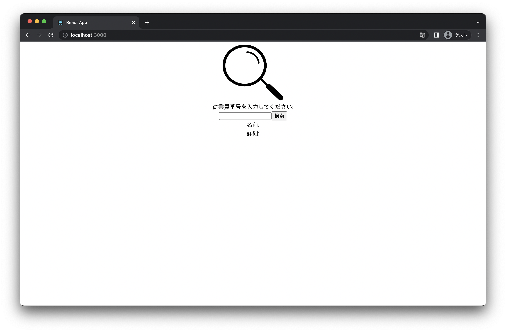
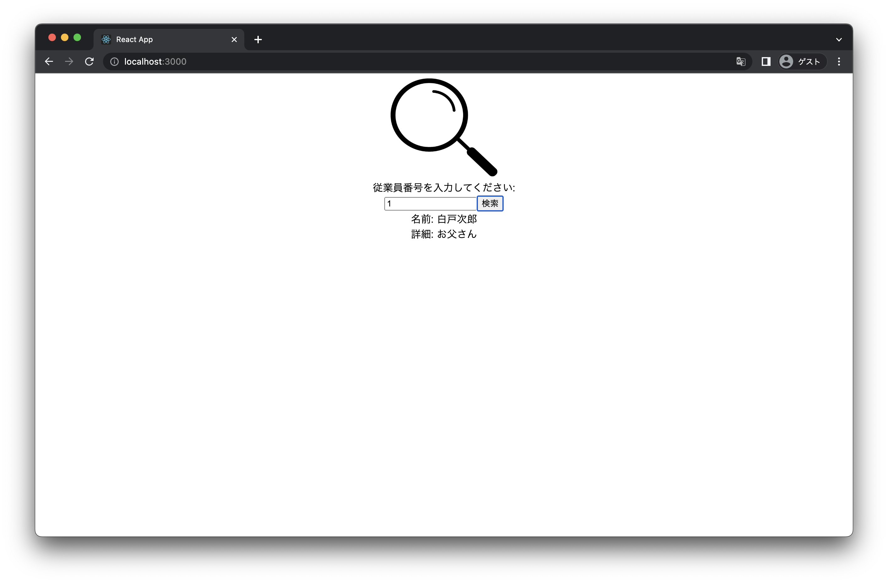
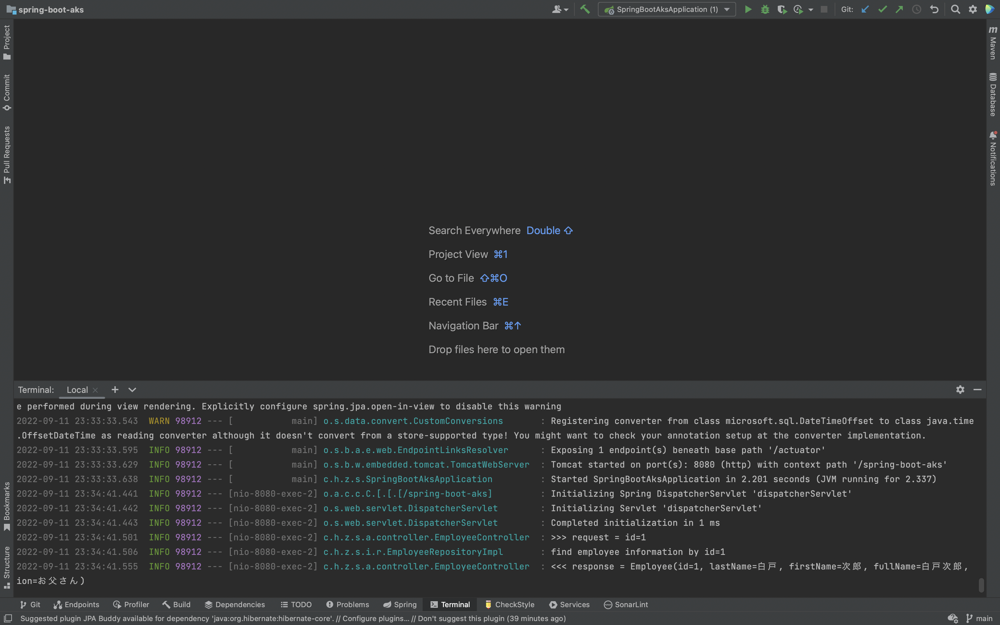
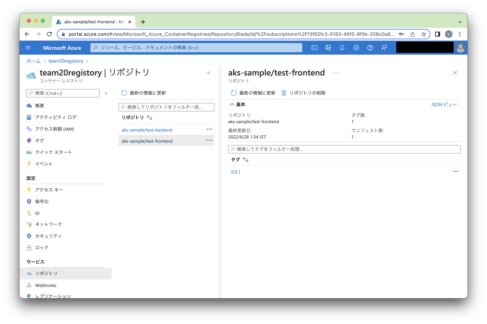
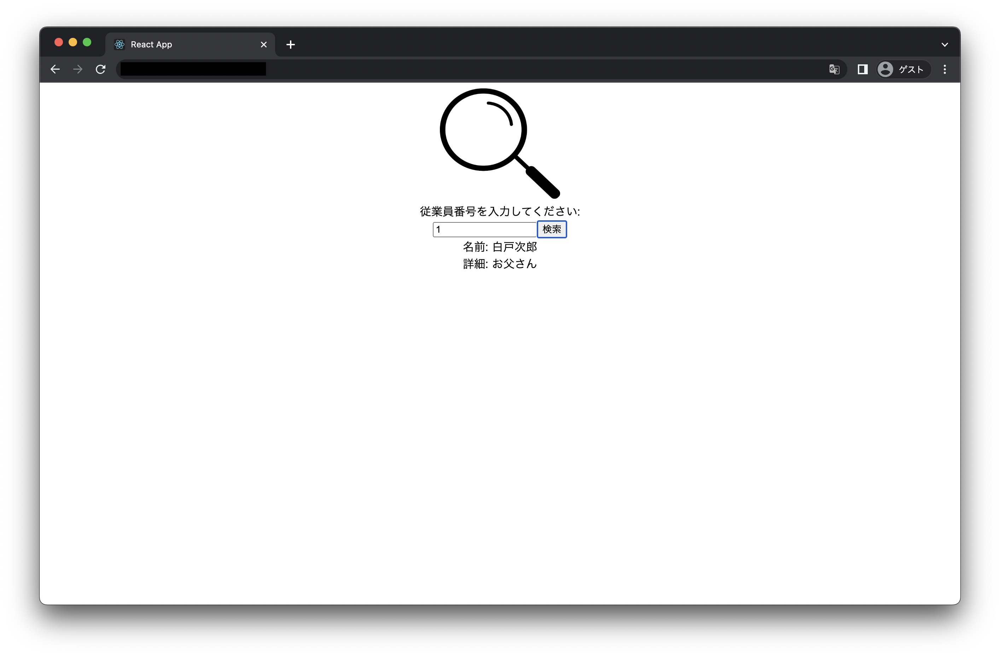

# React AKS Frontend サンプル・アプリケーションの実行

## 前提
本手順は、Spring Boot AKS Backend サンプル・アプリケーションのローカル起動を前提として記述しているので、
まだ Backend サンプル・アプリケーションのローカル起動を済ませていない方は spring-book-aks ディレクトリにある README を参照して起動を済ませておいてから本手順を参照してください。

## ローカルでの起動

### 依存ライブラリのダウンロード
simple-employee-management/react-sample の下に移動し、以下のようになっていることを確認します。
```
$ cd simple-employee-management/react-sample
$ ls -a
.			            .gitignore		package-lock.json
..			          Doc			      package.json
.DS_Store		      Dockerfile		public
.env			        README.md		  src
.env.development	conf
.env.production		kubernetes
```

以下のコマンドを実行し、プロジェクトが依存しているライブラリをダウンロードします。
```
$ npm install
npm WARN deprecated stable@0.1.8: Modern JS already guarantees Array#sort() is a stable sort, so this library is deprecated. See the compatibility table on MDN: https://developer.mozilla.org/en-US/docs/Web/JavaScript/Reference/Global_Objects/Array/sort#browser_compatibility
npm WARN deprecated source-map-resolve@0.6.0: See https://github.com/lydell/source-map-resolve#deprecated
npm WARN deprecated svgo@1.3.2: This SVGO version is no longer supported. Upgrade to v2.x.x.

added 1447 packages, and audited 1448 packages in 10s

193 packages are looking for funding
  run `npm fund` for details

6 high severity vulnerabilities

To address all issues (including breaking changes), run:
  npm audit fix --force

Run `npm audit` for details.
```

### サンプル・アプリケーションの起動
以下のコマンドを実行し、React アプリケーションを起動します。
```
$ npm start
> react-sample@0.1.0 start
> react-scripts start

(node:8179) [DEP_WEBPACK_DEV_SERVER_ON_AFTER_SETUP_MIDDLEWARE] DeprecationWarning: 'onAfterSetupMiddleware' option is deprecated. Please use the 'setupMiddlewares' option.
(Use `node --trace-deprecation ...` to show where the warning was created)
(node:8179) [DEP_WEBPACK_DEV_SERVER_ON_BEFORE_SETUP_MIDDLEWARE] DeprecationWarning: 'onBeforeSetupMiddleware' option is deprecated. Please use the 'setupMiddlewares' option.
Starting the development server...
Compiled with warnings.

[eslint]
src/App.js
  Line 1:27:  'useEffect' is defined but never used  no-unused-vars

Search for the keywords to learn more about each warning.
To ignore, add // eslint-disable-next-line to the line before.

WARNING in [eslint]
src/App.js
  Line 1:27:  'useEffect' is defined but never used  no-unused-vars

webpack compiled with 1 warning
```

起動できたら、以下のように React アプリケーションが自動的にデフォルトのブラウザで表示されます。


入力欄に`1`を入力して検索ボタンを押したら、Backend に検索のリクエストを投げて、そのレスポンス（従業員情報）が画面に表示されることを確認します。


IntelliJ IDEA で Spring Boot が処理したリクエストおよびレスポンスのログも確認できます。



## サンプルの AKS へのデプロイ

### React 環境変数の編集
react-sample の直下に、`.env.development` と `.env.production` が存在します。`.env.*` 中に React の環境変数を定義することができます。 
`npm start` でローカルで React を起動する際は `.env.development` に定義された環境変数が適用され、React がローカルのデフォルトブラウザに表示されます。`npm build` で実行したら、`.env.production` に定義された環境変数が適用され、本番リリース用の資材が react-sample/build に生成されます。
本番環境へデプロイするために、`.env.production` の `REACT_APP_BACKEND_HOST` という環境変数を Backend Service の EXTERNAL-IP を記入します。
```
REACT_APP_BACKEND_HOST=xx.xx.xx.xx
```

### サンプルのコンテナ・イメージの作成および ACR へのコンテナ・イメージのプッシュ
react-sample の直下で、コンテナ・イメージをビルドします。tag に指定する teamNregistory
は自分の ACR 名を指定するようにしてください。（build には少々お時間がかかります。）
```
$ docker build -t team20registory.azurecr.io/aks-sample/test-frontend:0.0.1 .
[+] Building 281.2s (17/17) FINISHED
 => [internal] load build definition from Dockerfile                                                                                          0.0s
 => => transferring dockerfile: 478B                                                                                                          0.0s
 => [internal] load .dockerignore                                                                                                             0.0s
 => => transferring context: 2B                                                                                                               0.0s
 => [internal] load metadata for docker.io/library/nginx:latest                                                                               2.8s
 => [internal] load metadata for docker.io/library/node:16.15.1-slim                                                                          2.7s
 => [build 1/8] FROM docker.io/library/node:16.15.1-slim@sha256:16b5d00e95c0c9fc4b4c5493b3c9c648cb39d96869170585ebfedc0d84ce33ca             17.1s
 => => resolve docker.io/library/node:16.15.1-slim@sha256:16b5d00e95c0c9fc4b4c5493b3c9c648cb39d96869170585ebfedc0d84ce33ca                    0.0s
 => => sha256:16b5d00e95c0c9fc4b4c5493b3c9c648cb39d96869170585ebfedc0d84ce33ca 1.21kB / 1.21kB                                                0.0s
 => => sha256:ef9e0abfa1aa07d23cc51b69820885fc83f51c10fab463aec5a56f282dca744f 1.37kB / 1.37kB                                                0.0s
 => => sha256:e866f2db36954a83d204c31cda2760d590c4bb562589d05ab5e0d73a008d3196 7.03kB / 7.03kB                                                0.0s
 => => sha256:824b15f81d6568adc139263c39805e52d9880758b907f40144bbb1938ca59323 27.14MB / 27.14MB                                             14.8s
 => => sha256:325d38bcb229a103aabde45fab52521ff06c3998504637e7adbe7d7c807940f5 4.18kB / 4.18kB                                                5.3s
 => => sha256:d6d638bf61bf23712506c77f94f5d317f7e2204f88dfdc85bbf588fc0fbcb424 34.54MB / 34.54MB                                             13.1s
 => => sha256:55daac95cedfd136f1618037bc53d54ff83e5f1908856754ad3a5dfb76e2ad1b 2.74MB / 2.74MB                                               14.6s
 => => sha256:4c701498752de848c89397d883060d82d690743b2af1a035fd7d3db93ad4d9ea 452B / 452B                                                   14.8s
 => => extracting sha256:824b15f81d6568adc139263c39805e52d9880758b907f40144bbb1938ca59323                                                     0.9s
 => => extracting sha256:325d38bcb229a103aabde45fab52521ff06c3998504637e7adbe7d7c807940f5                                                     0.0s
 => => extracting sha256:d6d638bf61bf23712506c77f94f5d317f7e2204f88dfdc85bbf588fc0fbcb424                                                     0.9s
 => => extracting sha256:55daac95cedfd136f1618037bc53d54ff83e5f1908856754ad3a5dfb76e2ad1b                                                     0.1s
 => => extracting sha256:4c701498752de848c89397d883060d82d690743b2af1a035fd7d3db93ad4d9ea                                                     0.0s
 => [internal] load build context                                                                                                             0.0s
 => => transferring context: 95.45kB                                                                                                          0.0s
 => [stage-1 1/4] FROM docker.io/library/nginx@sha256:10f14ffa93f8dedf1057897b745e5ac72ac5655c299dade0aa434c71557697ea                       18.0s
 => => resolve docker.io/library/nginx@sha256:10f14ffa93f8dedf1057897b745e5ac72ac5655c299dade0aa434c71557697ea                                0.0s
 => => sha256:f4407ba1f103abb9ae05a4b2891c7ebebaecab0c262535fc6659a628db25df44 25.35MB / 25.35MB                                              5.0s
 => => sha256:4a7307612456a7f65365e1da5c3811df49cefa5a2fd68d8e04e093d26a395d60 603B / 603B                                                    0.9s
 => => sha256:55f4b40fe486a5b734b46bb7bf28f52fa31426bf23be068c8e7b19e58d9b8deb 7.66kB / 7.66kB                                                0.0s
 => => sha256:b85a868b505ffd0342a37e6a3b1c49f7c71878afe569a807e6238ef08252fcb7 31.38MB / 31.38MB                                             16.1s
 => => sha256:10f14ffa93f8dedf1057897b745e5ac72ac5655c299dade0aa434c71557697ea 1.86kB / 1.86kB                                                0.0s
 => => sha256:3536d368b898eef291fb1f6d184a95f8bc1a6f863c48457395aab859fda354d1 1.57kB / 1.57kB                                                0.0s
 => => sha256:935cecace2a02d2545e0c19bd52fe9c8c728fbab2323fc274e029f5357cda689 893B / 893B                                                    1.3s
 => => sha256:8f46223e4234ce76b244c074e79940b9ee0a01b42050012c8555ebc7ac59469e 666B / 666B                                                    2.2s
 => => sha256:fe0ef4c895f5ea450aca17342e481fada37bf2a1ee85d127a4473216c3f672ea 1.39kB / 1.39kB                                                2.6s
 => => extracting sha256:b85a868b505ffd0342a37e6a3b1c49f7c71878afe569a807e6238ef08252fcb7                                                     0.9s
 => => extracting sha256:f4407ba1f103abb9ae05a4b2891c7ebebaecab0c262535fc6659a628db25df44                                                     0.6s
 => => extracting sha256:4a7307612456a7f65365e1da5c3811df49cefa5a2fd68d8e04e093d26a395d60                                                     0.0s
 => => extracting sha256:935cecace2a02d2545e0c19bd52fe9c8c728fbab2323fc274e029f5357cda689                                                     0.0s
 => => extracting sha256:8f46223e4234ce76b244c074e79940b9ee0a01b42050012c8555ebc7ac59469e                                                     0.0s
 => => extracting sha256:fe0ef4c895f5ea450aca17342e481fada37bf2a1ee85d127a4473216c3f672ea                                                     0.0s
 => [build 2/8] COPY [package.json, ./]                                                                                                       0.2s
 => [build 3/8] RUN npm install                                                                                                             212.5s
 => [stage-1 2/4] RUN rm -rf /etc/nginx/conf.d                                                                                                0.2s
 => [stage-1 3/4] COPY conf /etc/nginx                                                                                                        0.0s
 => [build 4/8] COPY public /public/                                                                                                          0.1s
 => [build 5/8] COPY src /src/                                                                                                                0.0s
 => [build 6/8] COPY .env.production                                                                                                          0.0s
 => [build 7/8] RUN npm run build                                                                                                            47.6s
 => [stage-1 4/4] COPY --from=build /build /usr/share/nginx/html                                                                              0.0s
 => exporting to image                                                                                                                        0.0s
 => => exporting layers                                                                                                                       0.0s
 => => writing image sha256:f148246a1d1a8ca0047971f3d4a7b1427701ef22bd42ec611e52edf0981f2e1c                                                  0.0s
 => => naming to team20registory.azurecr.io/aks-sample/test-frontend:0.0.1                                                                    0.0s

Use 'docker scan' to run Snyk tests against images to find vulnerabilities and learn how to fix them
```

以下のコマンドを実行し、指定したリポジトリ、タグでコンテナ・イメージが作成されていることを確認します。
```
$ docker images
REPOSITORY                                            TAG       IMAGE ID       CREATED              SIZE
team20registory.azurecr.io/aks-sample/test-frontend   0.0.1     60ed40396188   About a minute ago   142MB
team20registory.azurecr.io/aks-sample/test-backend    0.0.1     77fce7ccbe52   23 hours ago         341MB
mcr.microsoft.com/azure-sql-edge                      latest    c0db2d0e0637   13 days ago          1.83GB
```

すでに Backend のデプロイでは ACR へのログインは済ませたため、そのまま以下のコマンドでコンテナ・イメージを ACR へプッシュします。
```
$ docker push team20registory.azurecr.io/aks-sample/test-frontend:0.0.1
The push refers to repository [team20registory.azurecr.io/aks-sample/test-frontend]
2da0e1f03b63: Pushed
33da95abb9f6: Pushed
e009fc5b172d: Pushed
e7344f8a29a3: Pushed
44193d3f4ea2: Pushed
41451f050aa8: Pushed
b2f82de68e0d: Pushed
d5b40e80384b: Pushed
08249ce7456a: Pushed
0.0.1: digest: sha256:975297231db66956d31e8d22e95de179faccc5524e0ff99546c33f7770346e00 size: 2194
```

Azure Portal からチームの ACR のリポジトリから、プッシュしたコンテナ・イメージが確認できます。



### Kubernetes のマニフェストの編集
react-sample/kubernetes 下に移動し、deployment-frontend.yaml の container name を先のタグ付けのコンテナ・イメージ名に修正します。
```
spec:
      imagePullSecrets:
      - name: docker-reg-credential
      containers:
      - name: aks-sample-frontend
        image: team20registory.azurecr.io/aks-sample/test-frontend:0.0.1
        resources:
          requests:
            cpu: 500m
            memory: 500Mi
          limits:
            cpu: 1
            memory: 1G
```

### サービスのデプロイ
service-frontend.yaml と deployment-frontend.yaml を scp で雑用 vm に持ち込みます。持ち込みの際に、
雑用 vm のパスワードが求められるます。
```
$ scp service-frontend.yaml USENAME@xx.xx.xx.xx:~/.
USENAME@xx.xx.xx.xx's password:
service-frontend.yaml                                                                                      100%  288    21.5KB/s   00:00
$ scp deployment-frontend.yaml USENAME@xx.xx.xx.xx:~/.
USENAME@xx.xx.xx.xx's password:
deployment-frontend.yaml                                                                                         100%  590    54.0KB/s   00:00
```

雑用 vm に ssh でログインし、ユーザフォルダの直下に先ほど持ち込んだファイルがあることを確認します。
```
$ ssh USENAME@xx.xx.xx.xx
USENAME@xx.xx.xx.xx's password:
Welcome to Ubuntu 20.04.4 LTS (GNU/Linux 5.13.0-1031-azure x86_64)

 * Documentation:  https://help.ubuntu.com
 * Management:     https://landscape.canonical.com
 * Support:        https://ubuntu.com/advantage

  System information as of Mon Jun 27 16:47:16 UTC 2022

  System load:  0.0                Processes:             117
  Usage of /:   10.7% of 28.90GB   Users logged in:       0
  Memory usage: 11%                IPv4 address for eth0: 10.20.2.4
  Swap usage:   0%

 * Super-optimized for small spaces - read how we shrank the memory
   footprint of MicroK8s to make it the smallest full K8s around.

   https://ubuntu.com/blog/microk8s-memory-optimisation

7 updates can be applied immediately.
To see these additional updates run: apt list --upgradable


*** System restart required ***
Last login: Mon Jun 27 09:55:27 2022 from xx.xx.xx.xx


$ ls -l
-rwxr-xr-x 1 USERNAME USERGROUP 2536 Jun 27 09:53 deployment-backend.yaml
-rw-r--r-- 1 USERNAME USERGROUP  590 Jun 27 16:46 deployment-frontend.yaml
-rwxr-xr-x 1 USERNAME USERGROUP  287 Jun 27 09:50 service-backend.yaml
-rw-r--r-- 1 USERNAME USERGROUP  288 Jun 27 16:44 service-frontend.yaml
```

雑用 vm で以下のコマンドを実行して、サービスをデプロイします。
```
$ kubectl apply -f service-frontend.yaml
service/aks-sample-frontend-load-balancer created
```

雑用 vm で以下のコマンドを実行して、Frontend Service の EXTERNAL-IP が割り当てられていることを確認します。
EXTERNAL-IP の割当にはしばらく時間がかかります。
```
$ kubectl get service
NAME                                TYPE           CLUSTER-IP     EXTERNAL-IP    PORT(S)        AGE
aks-sample-backend-load-balancer    LoadBalancer   xx.xx.xx.xx    xx.xx.xx.xx    80:30510/TCP   22h
aks-sample-frontend-load-balancer   LoadBalancer   xx.xx.xx.xx    xx.xx.xx.xx   80:31946/TCP   107s
kubernetes                          ClusterIP      10.0.0.1       <none>         443/TCP        30h
```

サービスが作成できたら、以下のコマンドを実行してコンテナをデプロイします。
Frontend Pod の READY がすべて 1/1 となっていれば準備完了です。
```
$ kubectl apply -f deployment-frontend.yaml
deployment.apps/aks-sample-frontend created


$ kubectl get deployment
NAME                  READY   UP-TO-DATE   AVAILABLE   AGE
aks-sample-backend    3/3     3            3           23h
aks-sample-frontend   3/3     3            3           7s


$ kubectl get pod
NAME                                  READY   STATUS    RESTARTS   AGE
aks-sample-backend-6f6d879f84-c5vql   1/1     Running   0          23h
aks-sample-backend-6f6d879f84-l72hb   1/1     Running   0          23h
aks-sample-backend-6f6d879f84-zk9rs   1/1     Running   0          23h
aks-sample-frontend-ddf5bf558-ckr2z   1/1     Running   0          43s
aks-sample-frontend-ddf5bf558-sjjtr   1/1     Running   0          43s
aks-sample-frontend-ddf5bf558-wgffw   1/1     Running   0          43s
```

雑用 vm からログアウトします。
```
$ exit
logout
Connection to xx.xx.xx.xx closed.
```

## サンプル・アプリケーションの動作確認
ブラウザで Frontend Service の EXTERNAL-IP で割り当てられている IP アドレスにアクセスし、入力欄に1を入力して検索ボタンを押したら、正常に従業員情報が画面に表示されることを確認します。

