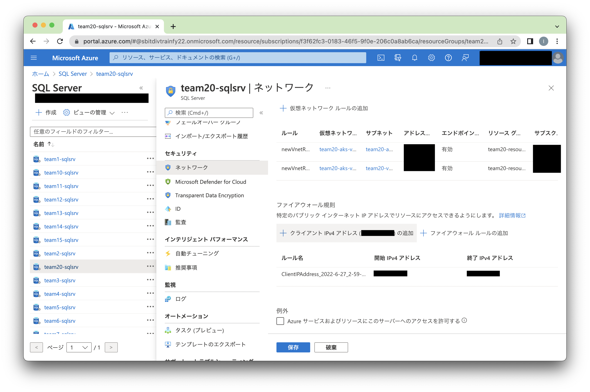

# Spring Boot AKS Backend サンプル・アプリケーションの実行

## サンプル・リポジトリのクローン

以下のコマンドを実行し、適当な場所にサンプル・アプリケーションのリポジトリをクローンします。

```
$ git clone git@github.com:zzh43/simple-employee-management.git
Cloning into 'simple-employee-management'...
remote: Enumerating objects: 234, done.
remote: Counting objects: 100% (234/234), done.
remote: Compressing objects: 100% (144/144), done.
remote: Total 234 (delta 40), reused 221 (delta 30), pack-reused 0
Receiving objects: 100% (234/234), 8.89 MiB | 4.46 MiB/s, done.
Resolving deltas: 100% (40/40), done.
```

simple-employee-management/spring-boot-aks 下に移動し、以下のようになっていることを確認します。

```
$ cd employee/spring-boot-aks
$ ls
README.md	mvnw		pom.xml
doc		mvnw.cmd	src
```

## ローカル環境での起動
### ローカル開発用データベースコンテナ の起動
simple-employee-management/spring-boot-aks/src/docker 下に移動し、docker-compose でローカル開発環境用のデータベースのコンテナを起動します。 （初めて起動する場合はコンテナイメージをタウンロードする必要があるため、少し時間がかかります。）

```
$ cd src/docker
$ docker-compose up -d
Pulling mssql (mcr.microsoft.com/azure-sql-edge:)...
latest: Pulling from azure-sql-edge
8376114ff9b3: Pull complete
bb3f6db1ca73: Pull complete
983f61788a4a: Pull complete
9a0d43969798: Pull complete
bba183e85bbe: Pull complete
df8f8eb18a6e: Pull complete
395f36ad668e: Pull complete
d4e475881410: Pull complete
3c39c3626fb8: Pull complete
43febce9b640: Pull complete
388e5d56d261: Pull complete
Digest: sha256:dfce05471e259d330e00bc9e66904254d75b714b35edc81495b4faee4a2dba96
Status: Downloaded newer image for mcr.microsoft.com/azure-sql-edge:latest
Creating azuresqledge ... done
```

azure sql edge のコンテナが起動していることを確認します。
```
$ docker ps
CONTAINER ID   IMAGE                              COMMAND                  CREATED      STATUS        PORTS                              NAMES
ca2f759b2262   mcr.microsoft.com/azure-sql-edge   "/opt/mssql/bin/perm…"   7 days ago   Up 26 hours   1401/tcp, 0.0.0.0:1433->1433/tcp   azuresqledge
```

### プロジェクト管理ツール Maven のインストール
まず、以下のコマンドで Maven をインストールします。
```
$ brew install maven
Running `brew update --auto-update`...
==> Auto-updated Homebrew!
Updated 2 taps (homebrew/core and homebrew/cask).
==> New Formulae
aztfy                                     podman-compose                            qbe                                       trzsz-go

You have 3 outdated formulae installed.
You can upgrade them with brew upgrade
or list them with brew outdated.

==> Downloading https://ghcr.io/v2/homebrew/core/maven/manifests/3.8.6
Already downloaded: /Users/zheng/Library/Caches/Homebrew/downloads/1eaef3c06595bd8696cab836e675ede6762e22509da857362f376eeb5209220d--maven-3.8.6.bottle_manifest.json
==> Downloading https://ghcr.io/v2/homebrew/core/maven/blobs/sha256:0468fde1ed91dda88ce1be54ca222c23f9436e579e5e45a2ca38c26dda304e7f
Already downloaded: /Users/zheng/Library/Caches/Homebrew/downloads/d43662b926931d886e652f88a11d7d1cd71e8cd9acc856f8d3af56c45d4692e6--maven--3.8.6.arm64_monterey.bottle.tar.gz
==> Pouring maven--3.8.6.arm64_monterey.bottle.tar.gz
🍺  /opt/homebrew/Cellar/maven/3.8.6: 78 files, 9.7MB
==> Running `brew cleanup maven`...
Disable this behaviour by setting HOMEBREW_NO_INSTALL_CLEANUP.
Hide these hints with HOMEBREW_NO_ENV_HINTS (see `man brew`).
```
以下のコマンドで、正常にインストールできたことを確認します。
```
$ mvn -v
Apache Maven 3.8.6 (84538c9988a25aec085021c365c560670ad80f63)
Maven home: /opt/homebrew/Cellar/maven/3.8.6/libexec
Java version: 18.0.1.1, vendor: Homebrew, runtime: /opt/homebrew/Cellar/openjdk/18.0.1.1/libexec/openjdk.jdk/Contents/Home
Default locale: ja_JP, platform encoding: UTF-8
OS name: "mac os x", version: "12.4", arch: "aarch64", family: "mac"
```

### flyway によるデータベース・マイグレーション

まず、simple-employee-management/spring-boot-aks/src/main/resources/db/migration 下に、以下のような SQL ファイルが存在することを確認します。

```
$ cd simple-employee-management/spring-boot-aks/src/main/resources/db/migration
$ ls -l
total 16
-rw-r--r--  1 zheng  staff   205  6 27 01:31 V1.0.0__create_table.sql
-rw-r--r--  1 zheng  staff  1295  6 27 01:31 V1.0.1__insert_employee.sql
```

ここで、以下のサイトでも説明されているように、V<バージョン番号>__<ファイル名>.sql
のようにファイル名のバージョン番号が非常に重要です。

-「[【Java】シンプルなデータベースマイグレーションツール「flyway」を導入する](https://blog.honjala.net/entry/2016/03/07/015951)」

pom.xml にて、local プロファイルの設定を確認します。
`<flyway.user>`、`<flyway.password>`、`<flyway.url>` を適切に JDBC の接続情報を設定する必要があります。
サンプルではローカルの Azure Sql Edge のコンテナに設定されているので、このままで問題ありません。

```
<profile>
    <id>local</id>
		<activation>
			<activeByDefault>true</activeByDefault>
		</activation>
		<properties>
			<flyway.user>sa</flyway.user>
			<flyway.password>welcome1#</flyway.password>
			<flyway.url><![CDATA[jdbc:sqlserver://localhost:1433;trustServerCertificate=true]]></flyway.url>
		</properties>
	</profile>
                                  :
</profiles>
```

pom.xml が存在するディレクトリにて、以下のように flyway:migrate を実行します。

```
$ mvn flyway:migrate
[INFO] Scanning for projects...
[INFO]
[INFO] ----------------< com.hotmail.zzh43:spring-boot-aks >-----------------
[INFO] Building spring-boot-aks 0.0.1-SNAPSHOT
[INFO] --------------------------------[ jar ]---------------------------------
[INFO]
[INFO] --- flyway-maven-plugin:7.5.3:migrate (default-cli) @ spring-boot-aks ---
[INFO] Flyway Community Edition 7.5.3 by Redgate
[INFO] Database: jdbc:sqlserver://localhost:1433;connectRetryInterval=10;connectRetryCount=1;maxResultBuffer=-1;sendTemporalDataTypesAsStringForBulkCopy=true;delayLoadingLobs=true;useFmtOnly=false;useBulkCopyForBatchInsert=false;cancelQueryTimeout=-1;sslProtocol=TLS;jaasConfigurationName=SQLJDBCDriver;statementPoolingCacheSize=0;serverPreparedStatementDiscardThreshold=10;enablePrepareOnFirstPreparedStatementCall=false;fips=false;socketTimeout=0;authentication=NotSpecified;authenticationScheme=nativeAuthentication;xopenStates=false;sendTimeAsDatetime=true;replication=false;trustStoreType=JKS;trustServerCertificate=true;TransparentNetworkIPResolution=true;serverNameAsACE=false;sendStringParametersAsUnicode=true;selectMethod=direct;responseBuffering=adaptive;queryTimeout=-1;packetSize=8000;multiSubnetFailover=false;loginTimeout=15;lockTimeout=-1;lastUpdateCount=true;encrypt=true;disableStatementPooling=true;columnEncryptionSetting=Disabled;applicationName=Microsoft JDBC Driver for SQL Server;applicationIntent=readwrite; (Microsoft SQL Server 15.0)
[INFO] Successfully validated 2 migrations (execution time 00:00.049s)
[INFO] Creating Schema History table [master].[dbo].[flyway_schema_history] ...
[INFO] Current version of schema [dbo]: << Empty Schema >>
[INFO] Migrating schema [dbo] to version "1.0.0 - create table"
[INFO] Migrating schema [dbo] to version "1.0.1 - insert employee"
[INFO] Successfully applied 2 migrations to schema [dbo] (execution time 00:00.169s)
[INFO] Flyway Community Edition 7.5.3 by Redgate
[INFO] ------------------------------------------------------------------------
[INFO] BUILD SUCCESS
[INFO] ------------------------------------------------------------------------
[INFO] Total time:  1.613 s
[INFO] Finished at: 2022-06-27T01:57:42+09:00
[INFO] ------------------------------------------------------------------------
```

sqlcmd 等で、SQL Database に接続して、データベースがマイグレーションされていることを確認します。

```
$ sqlcmd -S localhost -U sa -P welcome1#
1> select * from employee;
2> go
id          last_name  first_name full_name  description
----------- ---------- ---------- ---------- -----------
          1 白戸         次郎         白戸次郎       お父さん
          2 白戸         正子         白戸正子       お母さん
          3 吉田         彩          吉田彩        上戸 彩
          4 桃          太郎         桃太郎        桃ちゃん
          5 浦島         太郎         浦島太郎       浦ちゃん
          6 金          太郎         金太郎        金ちゃん
          7 かぐや        姫          かぐや姫       かぐちゃん
          8 乙          姫          乙姫         乙ちゃん
          9 織          姫          織姫         織ちゃん

(9 rows affected)
```

sqlcmd でローカルのデータベースコンテナにアクセルする際に以下のようなエラーが出てくる場合があります。
```
Sqlcmd: Error: Microsoft ODBC Driver 17 for SQL Server : Login timeout expired.
Sqlcmd: Error: Microsoft ODBC Driver 17 for SQL Server : TCP Provider: Error code 0x2AF9.
Sqlcmd: Error: Microsoft ODBC Driver 17 for SQL Server : A network-related or instance-specific error has occurred while establishing a connection to SQL Server. Server is not found or not accessible. Check if instance name is correct and if SQL Server is configured to allow remote connections. For more information see SQL Server Books Online..
```

この場合は以下のコマンドでローカルのデータベースコンテナにアクセスしてください。
```
sqlcmd -S 127.0.0.1 -U sa -P welcome1#
```

sqlcmd がまだインストールされていない場合は、以下を参考に mssql-tools をインストールします。

-「[Linux に SQL Server コマンドライン ツール sqlcmd および bcp をインストールする](https://docs.microsoft.com/ja-jp/sql/linux/sql-server-linux-setup-tools?view=sql-server-ver15)」

### サンプルの起動

spring-boot-aks 直下に移動して、以下のコマンドを実行してサンプル・アプリケーションを起動します。

```
$ cd simple-employee-management
$ mvn spring-boot:run
[INFO] Scanning for projects...
[INFO] 
[INFO] ----------------< com.hotmail.zzh43:spring-boot-aks >-----------------
[INFO] Building spring-boot-aks 0.0.1-SNAPSHOT
[INFO] --------------------------------[ jar ]---------------------------------
[INFO] 
[INFO] >>> spring-boot-maven-plugin:2.7.0:run (default-cli) > test-compile @ spring-boot-aks >>>
[INFO] 
[INFO] --- maven-resources-plugin:3.2.0:resources (default-resources) @ spring-boot-aks ---
[INFO] Using 'UTF-8' encoding to copy filtered resources.
[INFO] Using 'UTF-8' encoding to copy filtered properties files.
[INFO] Copying 2 resources
[INFO] Copying 2 resources
[INFO] 
[INFO] --- maven-compiler-plugin:3.10.1:compile (default-compile) @ spring-boot-aks ---
[INFO] Nothing to compile - all classes are up to date
[INFO] 
[INFO] --- maven-resources-plugin:3.2.0:testResources (default-testResources) @ spring-boot-aks ---
[INFO] Using 'UTF-8' encoding to copy filtered resources.
[INFO] Using 'UTF-8' encoding to copy filtered properties files.
[INFO] Copying 2 resources
[INFO] 
[INFO] --- maven-compiler-plugin:3.10.1:testCompile (default-testCompile) @ spring-boot-aks ---
[INFO] Nothing to compile - all classes are up to date
[INFO] 
[INFO] <<< spring-boot-maven-plugin:2.7.0:run (default-cli) < test-compile @ spring-boot-aks <<<
[INFO] 
[INFO] 
[INFO] --- spring-boot-maven-plugin:2.7.0:run (default-cli) @ spring-boot-aks ---
[INFO] Attaching agents: []

  .   ____          _            __ _ _
 /\\ / ___'_ __ _ _(_)_ __  __ _ \ \ \ \
( ( )\___ | '_ | '_| | '_ \/ _` | \ \ \ \
 \\/  ___)| |_)| | | | | || (_| |  ) ) ) )
  '  |____| .__|_| |_|_| |_\__, | / / / /
 =========|_|==============|___/=/_/_/_/
 :: Spring Boot ::                (v2.7.0)

2022-06-27 02:07:32.271  INFO 46809 --- [           main] j.c.s.f.s.SpringBootAksApplication       : Starting SpringBootAksApplication using Java 18.0.1.1 on zzhs-MacBook-Pro.local with PID 46809 (/Users/zheng/Desktop/pbl_sample/spring-boot-aks/target/classes started by zheng in /Users/zheng/Desktop/pbl_sample/spring-boot-aks)
2022-06-27 02:07:32.272  INFO 46809 --- [           main] j.c.s.f.s.SpringBootAksApplication       : No active profile set, falling back to 1 default profile: "default"
2022-06-27 02:07:32.616  INFO 46809 --- [           main] .s.d.r.c.RepositoryConfigurationDelegate : Multiple Spring Data modules found, entering strict repository configuration mode!
2022-06-27 02:07:32.616  INFO 46809 --- [           main] .s.d.r.c.RepositoryConfigurationDelegate : Bootstrapping Spring Data JDBC repositories in DEFAULT mode.
2022-06-27 02:07:32.621  INFO 46809 --- [           main] .s.d.r.c.RepositoryConfigurationDelegate : Finished Spring Data repository scanning in 3 ms. Found 0 JDBC repository interfaces.
2022-06-27 02:07:32.624  INFO 46809 --- [           main] .s.d.r.c.RepositoryConfigurationDelegate : Multiple Spring Data modules found, entering strict repository configuration mode!
2022-06-27 02:07:32.624  INFO 46809 --- [           main] .s.d.r.c.RepositoryConfigurationDelegate : Bootstrapping Spring Data JPA repositories in DEFAULT mode.
2022-06-27 02:07:32.627  INFO 46809 --- [           main] .s.d.r.c.RepositoryConfigurationDelegate : Finished Spring Data repository scanning in 1 ms. Found 0 JPA repository interfaces.
2022-06-27 02:07:32.631  INFO 46809 --- [           main] .s.d.r.c.RepositoryConfigurationDelegate : Multiple Spring Data modules found, entering strict repository configuration mode!
2022-06-27 02:07:32.632  INFO 46809 --- [           main] .s.d.r.c.RepositoryConfigurationDelegate : Bootstrapping Spring Data Redis repositories in DEFAULT mode.
2022-06-27 02:07:32.636  INFO 46809 --- [           main] .s.d.r.c.RepositoryConfigurationDelegate : Finished Spring Data repository scanning in 1 ms. Found 0 Redis repository interfaces.
2022-06-27 02:07:32.919  INFO 46809 --- [           main] o.s.b.w.embedded.tomcat.TomcatWebServer  : Tomcat initialized with port(s): 8080 (http)
2022-06-27 02:07:32.924  INFO 46809 --- [           main] o.apache.catalina.core.StandardService   : Starting service [Tomcat]
2022-06-27 02:07:32.924  INFO 46809 --- [           main] org.apache.catalina.core.StandardEngine  : Starting Servlet engine: [Apache Tomcat/9.0.63]
2022-06-27 02:07:32.966  INFO 46809 --- [           main] o.a.c.c.C.[.[.[/spring-boot-aks]         : Initializing Spring embedded WebApplicationContext
2022-06-27 02:07:32.967  INFO 46809 --- [           main] w.s.c.ServletWebServerApplicationContext : Root WebApplicationContext: initialization completed in 676 ms
2022-06-27 02:07:33.139  INFO 46809 --- [           main] com.zaxxer.hikari.HikariDataSource       : HikariPool-1 - Starting...
2022-06-27 02:07:33.332  INFO 46809 --- [           main] com.zaxxer.hikari.HikariDataSource       : HikariPool-1 - Start completed.
2022-06-27 02:07:33.354  INFO 46809 --- [           main] o.hibernate.jpa.internal.util.LogHelper  : HHH000204: Processing PersistenceUnitInfo [name: default]
2022-06-27 02:07:33.372  INFO 46809 --- [           main] org.hibernate.Version                    : HHH000412: Hibernate ORM core version 5.6.9.Final
2022-06-27 02:07:33.440  INFO 46809 --- [           main] o.hibernate.annotations.common.Version   : HCANN000001: Hibernate Commons Annotations {5.1.2.Final}
2022-06-27 02:07:33.491  INFO 46809 --- [           main] org.hibernate.dialect.Dialect            : HHH000400: Using dialect: org.hibernate.dialect.SQLServer2016Dialect
2022-06-27 02:07:33.582  INFO 46809 --- [           main] o.h.e.t.j.p.i.JtaPlatformInitiator       : HHH000490: Using JtaPlatform implementation: [org.hibernate.engine.transaction.jta.platform.internal.NoJtaPlatform]
2022-06-27 02:07:33.586  INFO 46809 --- [           main] j.LocalContainerEntityManagerFactoryBean : Initialized JPA EntityManagerFactory for persistence unit 'default'
2022-06-27 02:07:33.680  WARN 46809 --- [           main] .s.s.UserDetailsServiceAutoConfiguration : 

Using generated security password: 84ad881a-6b3e-4950-9f7f-d7e2afbc7dac

This generated password is for development use only. Your security configuration must be updated before running your application in production.

2022-06-27 02:07:33.722  INFO 46809 --- [           main] o.s.s.web.DefaultSecurityFilterChain     : Will secure any request with [org.springframework.security.web.session.DisableEncodeUrlFilter@d08f85a, org.springframework.security.web.context.request.async.WebAsyncManagerIntegrationFilter@3e839aa3, org.springframework.security.web.context.SecurityContextPersistenceFilter@2a4cb8ae, org.springframework.security.web.header.HeaderWriterFilter@579dde54, org.springframework.security.web.authentication.logout.LogoutFilter@37e64e37, org.springframework.security.web.savedrequest.RequestCacheAwareFilter@17e6b7e4, org.springframework.security.web.servletapi.SecurityContextHolderAwareRequestFilter@11c25846, org.springframework.security.web.authentication.AnonymousAuthenticationFilter@751bb780, org.springframework.security.web.session.SessionManagementFilter@6c49ea0c, org.springframework.security.web.access.ExceptionTranslationFilter@1c98fe6f]
2022-06-27 02:07:33.749  WARN 46809 --- [           main] JpaBaseConfiguration$JpaWebConfiguration : spring.jpa.open-in-view is enabled by default. Therefore, database queries may be performed during view rendering. Explicitly configure spring.jpa.open-in-view to disable this warning
2022-06-27 02:07:34.083  WARN 46809 --- [           main] o.s.data.convert.CustomConversions       : Registering converter from class microsoft.sql.DateTimeOffset to class java.time.OffsetDateTime as reading converter although it doesn't convert from a store-supported type! You might want to check your annotation setup at the converter implementation.
2022-06-27 02:07:34.132  INFO 46809 --- [           main] o.s.b.a.e.web.EndpointLinksResolver      : Exposing 1 endpoint(s) beneath base path '/actuator'
2022-06-27 02:07:34.163  INFO 46809 --- [           main] o.s.b.w.embedded.tomcat.TomcatWebServer  : Tomcat started on port(s): 8080 (http) with context path '/spring-boot-aks'
2022-06-27 02:07:34.172  INFO 46809 --- [           main] j.c.s.f.s.SpringBootAksApplication       : Started SpringBootAksApplication in 2.034 seconds (JVM running for 2.168)
```

### サンプルの実行

Postman で、http://localhost:8080/spring-boot-aks/v1/employee/1 に HTTP GET のリクエストを投げて、
正常にレスポンスが返ってくることを確認できます。


## サンプルの AKS へのデプロイ

### サンプルのビルド

サンプルを AKS にデプロイするためには、まず docker コンテナを作成する必要があります。
spring-boot-aks 直下に移動して、以下のコマンドを実行してサンプル・アプリケーションをビルドします。

```
$ mvn clean install -Dmaven.test.skip=true
[INFO] Scanning for projects...
[INFO]
[INFO] ----------------< com.hotmail.zzh43:spring-boot-aks >-----------------
[INFO] Building spring-boot-aks 0.0.1-SNAPSHOT
[INFO] --------------------------------[ jar ]---------------------------------
[INFO]
[INFO] --- maven-clean-plugin:3.2.0:clean (default-clean) @ spring-boot-aks ---
[INFO]
[INFO] --- maven-resources-plugin:3.2.0:resources (default-resources) @ spring-boot-aks ---
[INFO] Using 'UTF-8' encoding to copy filtered resources.
[INFO] Using 'UTF-8' encoding to copy filtered properties files.
[INFO] Copying 2 resources
[INFO] Copying 2 resources
[INFO]
[INFO] --- maven-compiler-plugin:3.10.1:compile (default-compile) @ spring-boot-aks ---
[INFO] Changes detected - recompiling the module!
[INFO] Compiling 16 source files to /Users/zheng/Desktop/temp/pbl_sample/spring-boot-aks/target/classes
[INFO]
[INFO] --- maven-resources-plugin:3.2.0:testResources (default-testResources) @ spring-boot-aks ---
[INFO] Not copying test resources
[INFO]
[INFO] --- maven-compiler-plugin:3.10.1:testCompile (default-testCompile) @ spring-boot-aks ---
[INFO] Not compiling test sources
[INFO]
[INFO] --- maven-surefire-plugin:2.22.2:test (default-test) @ spring-boot-aks ---
[INFO] Tests are skipped.
[INFO]
[INFO] --- maven-jar-plugin:3.2.2:jar (default-jar) @ spring-boot-aks ---
[INFO] Building jar: /Users/zheng/Desktop/temp/pbl_sample/spring-boot-aks/target/spring-boot-sample.jar
[INFO]
[INFO] --- spring-boot-maven-plugin:2.7.0:repackage (repackage) @ spring-boot-aks ---
[INFO] Replacing main artifact with repackaged archive
[INFO]
[INFO] --- maven-install-plugin:2.5.2:install (default-install) @ spring-boot-aks ---
[INFO] Installing /Users/zheng/Desktop/temp/pbl_sample/spring-boot-aks/target/spring-boot-sample.jar to /Users/zheng/.m2/repository/jp/co/softbank/fy22/spring-boot-aks/0.0.1-SNAPSHOT/spring-boot-aks-0.0.1-SNAPSHOT.jar
[INFO] Installing /Users/zheng/Desktop/temp/pbl_sample/spring-boot-aks/pom.xml to /Users/zheng/.m2/repository/jp/co/softbank/fy22/spring-boot-aks/0.0.1-SNAPSHOT/spring-boot-aks-0.0.1-SNAPSHOT.pom
[INFO] ------------------------------------------------------------------------
[INFO] BUILD SUCCESS
[INFO] ------------------------------------------------------------------------
[INFO] Total time:  2.092 s
[INFO] Finished at: 2022-06-27T02:13:31+09:00
[INFO] ------------------------------------------------------------------------
```

target 下に spring-boot-sample.jar という名前の jar ファイルが作成されていることを確認します。

```
$ ls -l target
total 109920
drwxr-xr-x  6 zheng  staff       192  6 27 02:13 classes
drwxr-xr-x  3 zheng  staff        96  6 27 02:13 generated-sources
drwxr-xr-x  3 zheng  staff        96  6 27 02:13 maven-archiver
drwxr-xr-x  3 zheng  staff        96  6 27 02:13 maven-status
-rw-r--r--  1 zheng  staff  56246037  6 27 02:13 spring-boot-sample.jar
-rw-r--r--  1 zheng  staff     29447  6 27 02:13 spring-boot-sample.jar.original
```

### サンプルのコンテナ・イメージの作成

jar ファイルを docker の下にコピーし、コンテナ・イメージをビルドします。tag に指定する teamNregistory
は自分の ACR 名を指定するようにしてください。

```
$ cp target/spring-boot-sample.jar src/docker
$ cd src/docker
$ docker build -t team20registory.azurecr.io/aks-sample/test-backend:0.0.1 .
[+] Building 25.5s (7/7) FINISHED
 => [internal] load build definition from Dockerfile                                                                                            0.0s
 => => transferring dockerfile: 224B                                                                                                            0.0s
 => [internal] load .dockerignore                                                                                                               0.0s
 => => transferring context: 2B                                                                                                                 0.0s
 => [internal] load metadata for docker.io/azul/zulu-openjdk-alpine:17.0.2                                                                      3.5s
 => [1/2] FROM docker.io/azul/zulu-openjdk-alpine:17.0.2@sha256:b1770f182ea03ac0779626bdca3c11143e93a5daaf1277447bbda92e7a27dd21               21.6s
 => => resolve docker.io/azul/zulu-openjdk-alpine:17.0.2@sha256:b1770f182ea03ac0779626bdca3c11143e93a5daaf1277447bbda92e7a27dd21                0.0s
 => => sha256:2fff67b41c5232d28879242b7d45284917f91cf7481c47d76a96d05976cb4f23 145.70MB / 145.70MB                                             19.0s
 => => sha256:b1770f182ea03ac0779626bdca3c11143e93a5daaf1277447bbda92e7a27dd21 770B / 770B                                                      0.0s
 => => sha256:7f2bd522ee86ea2413a759ff7ef2e488bece4adf5ce2c1488ae6e006c3e03686 741B / 741B                                                      0.0s
 => => sha256:c7891cf6997083d7a5d2b9bb20b9cf8f5d50c5eb2d23490e52257a92b9b25174 2.54kB / 2.54kB                                                  0.0s
 => => sha256:df9b9388f04ad6279a7410b85cedfdcb2208c0a003da7ab5613af71079148139 2.81MB / 2.81MB                                                  0.6s
 => => extracting sha256:df9b9388f04ad6279a7410b85cedfdcb2208c0a003da7ab5613af71079148139                                                       0.3s
 => => extracting sha256:2fff67b41c5232d28879242b7d45284917f91cf7481c47d76a96d05976cb4f23                                                       2.5s
 => [internal] load build context                                                                                                               1.8s
 => => transferring context: 56.26MB                                                                                                            1.8s
 => [2/2] COPY spring-boot-sample.jar spring-boot-sample.jar                                                                                    0.2s
 => exporting to image                                                                                                                          0.1s
 => => exporting layers                                                                                                                         0.1s
 => => writing image sha256:77fce7ccbe52dc791dc5be06307695cb37679c550f11c37756cfe757e7bda746                                                    0.0s
 => => naming to team20registory.azurecr.io/aks-sample/test-backend:0.0.1                                                                       0.0s

Use 'docker scan' to run Snyk tests against images to find vulnerabilities and learn how to fix them
```

以下のコマンドを実行し、指定したリポジトリ、タグでコンテナ・イメージが作成されていることを確認します。

```
$ docker images
REPOSITORY                                           TAG       IMAGE ID       CREATED              SIZE
team20registory.azurecr.io/aks-sample/test-backend   0.0.1     77fce7ccbe52   About a minute ago   341MB
mcr.microsoft.com/azure-sql-edge                     latest    c0db2d0e0637   12 days ago          1.83GB
```

### ACR へのログイン

ACR にコンテナ・イメージをプッシュする前に、まず、ACR に docker login を実施しておく必要が
あります。まだ docker login していない場合は、以下のコマンドを実行して docker login します。
ログイン・サーバー、ユーザー名、パスワードは後述のとおり Azure Portal より確認できます。teamNregistory
は自分の ACR 名を指定するようにしてください。

```
$ docker login https://team20registory.azurecr.io
Username: team20registory
Password:
Login Succeeded
```

### ACR のログイン情報の確認

Azure Portal にログインし、画面上の検索バーで「コンテナ」と入力し、検索を実行します。検索結果の「コンテナー レジストリ」をクリックします。


コンテナーレジストリの一覧が表示されるので、自分のチームの ACR のリンクをクリックします。


左メニューの「設定」-「アクセスキー」をクリックします。


画面で、ログイン・サーバー、ユーザー名、パスワード (password) を確認します。


### コンテナ・イメージのプッシュ

ACR に docker login しているなら、以下のコマンドを実行して、コンテナ・イメージをプッシュします。

```
$ docker push team20registory.azurecr.io/aks-sample/test-backend:0.0.1
The push refers to repository [team20registory.azurecr.io/aks-sample/test-backend]
4c0ff185d191: Pushed
52dd98d3ea3c: Pushed
4fc242d58285: Pushed
0.0.1: digest: sha256:a053a17363c40ff06538600cb9c1f801118c931fd588152c599778a097af0045 size: 953
```

Azure Portal にログインし、ACR の画面にて、左メニューの「サービス」-「リポジトリ」で、ACR にプッシュされているコンテナ・イメージが確認できます。


リポジトリのリンクをクリックすることで、タグの一覧も確認できます。


### Kubernetes のマニフェストの編集

spring-boot-aks/src/kubernetes 下に移動し、deployment.yaml の以下の箇所を自身のチームに合わせて修正します。
具体的に修正する必要があるのは、image のイメージ名、DATASOURCE_URL の SQL サーバ名、REDIS_HOST の Redis ホスト名、および REDIS_PASSWORD のパスワードです。

```
containers:
  - name: aks-sample-backend
    image: team20registory.azurecr.io/aks-sample/test-backend:0.0.1
    env:
      - name: TZ
        value: JST-9
      - name: JAVA_TOOL_OPTIONS
        value: "-XX:+UseContainerSupport -XX:InitialRAMPercentage=50 -XX:MinRAMPercentage=50 -XX:MaxRAMPercentage=50 -XX:MetaspaceSize=128m -XX:MaxMetaspaceSize=128m -XX:InitialCodeCacheSize=64m -XX:ReservedCodeCacheSize=64m -XX:CompressedClassSpaceSize=64m -XX:NewRatio=1 -XX:+UseParallelGC -Xlog:gc*=info::time,uptime,level,tags -XX:+ExitOnOutOfMemoryError -Djava.net.preferIPv4Stack=true -Djava.awt.headless=true -Djava.security.egd=file:/dev/./urandom"
      - name: SPRING_PROFILES_ACTIVE
        value: "pr"
      - name: DATASOURCE_URL
        value: WRITE YOUR PRODUCTION DATABASE CONNECTION URL HERE
      - name: DATASOURCE_USER
        value: WRITE YOUR PRODUCTION DATABASE LOGIN USERNAME HERE
      - name: DATASOURCE_PASSWORD
        value: WRITE YOUR PRODUCTION DATABASE LOGIN PASSWORD HERE
      - name: REDIS_HOST
        value: WRITE YOUR PRODUCTION REDIS HOST URL HERE
      - name: REDIS_PORT
        value: WRITE YOUR PRODUCTION REDIS PORT NUMBER HERE
      - name: REDIS_PASSWORD
        value: WRITE YOUR PRODUCTION REDIS PASSWORD HERE
```

### Redis のパスワードの確認

Azure Portal にログインし、画面上の検索バーで「Redis」と入力し、検索を実行します。検索結果の「Azure Cache for Redis」をクリックします。


Redis の一覧が表示されるので、自分のチームの Redis のリンクをクリックします。


左メニューの「設定」-「アクセスキー」をクリックします。


画面で、プライマリに表示されている文字列が Redis のパスワードです。


### Azure SQL Database への local からの接続

Azure SQL Database への接続は Azure 側に用意している踏み台 (jumpbox) の VM から sqlcmd で接続可能です。
ここでは、ローカルから直接、Azure SQL Database に接続する手順について説明します。

Azure Portal にログインし、画面上の検索バーで「SQL」と入力し、検索を実行します。検索結果の「SQL Server」をクリックします。


SQL Server の一覧が表示されるので、自分のチームの SQL Server のリンクをクリックします。


左メニューの「セキュリティ」-「ネットワーク」をクリックします。


下までスクロールして、「クライアント IPv4 アドレス (xx.xx.xx.xx) の追加」をクリックします。


ファイアウォール規則に、ルール名 - 開始 IPv4 アドレス - 終了 IPv4 アドレスのレコードが追加されたことを確認して、画面上の「保存」ボタンをクリックします。



「サーバーのファイアウォール規則が正常に更新されました」と表示されれば、ファイアウォールの設定は完了です。


ローカルで sqlcmd、あるいは Azure Data Studio から接続してください。PBL 用の Azure SQL Database には XXX という名前で
データベースを作成していますので、データベース名を指定します。

```
$ sqlcmd -S DATABASE_URL -U USERNAME -P PASSWARD -d SCHEMA_NAME
1> exit
```

### Azure SQL Database への flyway によるデータベース・マイグレーション

Azure SQL Database への flyway によるデータベース・マイグレーションも基本的にローカルの SQL Database
と同じです。

pom.xml にて、pr プロファイルの設定を確認します。`<flyway.user>`、`<flyway.password>`、`<flyway.url>` 
を適切に JDBC の接続情報を設定する必要があります。ここで、`<flyway.url>` の SQL Server 名にチームのサーバ名
に変更してください。

```
<profiles>
                                  :
  <profile>
	<id>pr</id>
	<activation>
		<activeByDefault>false</activeByDefault>
	</activation>
	<properties>
		<flyway.user>USRNAME</flyway.user>
		<flyway.password>PASSWORD</flyway.password>
		<flyway.url>DATABASE_CONNECTION_URL</flyway.url>
	</properties>
   fl</profile>
</profiles>
```

さらに、pom.xml が存在するディレクトリにて、以下のように -P オプションで pr プロファイルを指定して flyway:migrate を実行します。

```
$ mvn flyway:migrate -P pr
[INFO] Scanning for projects...
[INFO]
[INFO] ----------------< com.hotmail.zzh43:spring-boot-aks >-----------------
[INFO] Building spring-boot-aks 0.0.1-SNAPSHOT
[INFO] --------------------------------[ jar ]---------------------------------
[INFO]
[INFO] --- flyway-maven-plugin:7.5.3:migrate (default-cli) @ spring-boot-aks ---
[INFO] Flyway Community Edition 7.5.3 by Redgate
[INFO] Database: jdbc:sqlserver://team20-sqlsrv.database.windows.net:1433;connectRetryInterval=10;connectRetryCount=1;maxResultBuffer=-1;sendTemporalDataTypesAsStringForBulkCopy=true;delayLoadingLobs=true;useFmtOnly=false;useBulkCopyForBatchInsert=false;cancelQueryTimeout=-1;sslProtocol=TLS;jaasConfigurationName=SQLJDBCDriver;statementPoolingCacheSize=0;serverPreparedStatementDiscardThreshold=10;enablePrepareOnFirstPreparedStatementCall=false;fips=false;socketTimeout=0;authentication=NotSpecified;authenticationScheme=nativeAuthentication;xopenStates=false;sendTimeAsDatetime=true;replication=false;trustStoreType=JKS;trustServerCertificate=false;TransparentNetworkIPResolution=true;serverNameAsACE=false;sendStringParametersAsUnicode=true;selectMethod=direct;responseBuffering=adaptive;queryTimeout=-1;packetSize=8000;multiSubnetFailover=false;loginTimeout=15;lockTimeout=-1;lastUpdateCount=true;encrypt=true;disableStatementPooling=true;databaseName=pbldb;columnEncryptionSetting=Disabled;applicationName=Microsoft JDBC Driver for SQL Server;applicationIntent=readwrite; (Microsoft SQL Server 12.0)
[INFO] Successfully validated 2 migrations (execution time 00:00.047s)
[INFO] Creating Schema History table [pbldb].[dbo].[flyway_schema_history] ...
[INFO] Current version of schema [dbo]: << Empty Schema >>
[INFO] Migrating schema [dbo] to version "1.0.0 - create table"
[INFO] Migrating schema [dbo] to version "1.0.1 - insert employee"
[INFO] Successfully applied 2 migrations to schema [dbo] (execution time 00:00.503s)
[INFO] Flyway Community Edition 7.5.3 by Redgate
[INFO] ------------------------------------------------------------------------
[INFO] BUILD SUCCESS
[INFO] ------------------------------------------------------------------------
[INFO] Total time:  2.063 s
[INFO] Finished at: 2022-06-27T03:28:53+09:00
[INFO] ------------------------------------------------------------------------
```

ローカルで sqlcmd、あるいは Azure Data Studio で、SQL Database に接続して、データベースがマイグレーションされていることを確認します。

```
$ sqlcmd -S DATABASE_URL -U USERNAME -P PASSWARD -d SCHEMA_NAME
1> select * from employee;
2> go
id          last_name  first_name full_name  description
----------- ---------- ---------- ---------- -----------
          1 白戸         次郎         白戸次郎       お父さん
          2 白戸         正子         白戸正子       お母さん
          3 吉田         彩          吉田彩        上戸 彩
          4 桃          太郎         桃太郎        桃ちゃん
          5 浦島         太郎         浦島太郎       浦ちゃん
          6 金          太郎         金太郎        金ちゃん
          7 かぐや        姫          かぐや姫       かぐちゃん
          8 乙          姫          乙姫         乙ちゃん
          9 織          姫          織姫         織ちゃん

(9 rows affected)
1> exit
```

### サービスのデプロイ

spring-boot-aks/src/kubernetes の下に移動し、service.yaml と deployment.yaml を scp で雑用 vm に持ち込みます。持ち込みの際に、
雑用 vm のパスワードが求められます。
```
$ scp service-backend.yaml USERNAME@xx.xx.xx.xx:~/.
USERNAME@xx.xx.xx.xx's password:
service-backend.yaml                                            100%  287    25.9KB/s   00:00
$ scp deployment-backend.yaml USERNAME@xx.xx.xx.xx:~/.
USERNAME@xx.xx.xx.xx's password:
deployment-backend.yaml                                         100% 2536    27.7KB/s   00:00
```

雑用 vm に ssh でログインし、ユーザフォルダの直下に先ほど持ち込んだファイルがあることを確認します。
```
$ ssh USERNAME@xx.xx.xx.xx
USERNAME@xx.xx.xx.xx's password:
Welcome to Ubuntu 20.04.4 LTS (GNU/Linux 5.13.0-1031-azure x86_64)

 * Documentation:  https://help.ubuntu.com
 * Management:     https://landscape.canonical.com
 * Support:        https://ubuntu.com/advantage

  System information as of Mon Jun 27 09:55:26 UTC 2022

  System load:  0.01               Processes:             116
  Usage of /:   10.7% of 28.90GB   Users logged in:       0
  Memory usage: 11%                IPv4 address for eth0: 10.20.2.4
  Swap usage:   0%

 * Super-optimized for small spaces - read how we shrank the memory
   footprint of MicroK8s to make it the smallest full K8s around.

   https://ubuntu.com/blog/microk8s-memory-optimisation

7 updates can be applied immediately.
To see these additional updates run: apt list --upgradable


*** System restart required ***
Last login: Sat Jun 25 15:54:38 2022 from xx.xx.xx.xx


$ ls -l
total 8
-rwxr-xr-x 1 USERNAME USERGROUP 2536 Jun 27 09:53 deployment-backend.yaml
-rwxr-xr-x 1 USERNAME USERGROUP  287 Jun 27 09:50 service-backend.yaml
```

雑用 vm で以下のコマンドを実行して、サービスをデプロイします。

```
$ kubectl apply -f service-backend.yaml 
service/aks-sample-backend-load-balancer created
```

雑用 vm で以下のコマンドを実行して、Backend Service の EXTERNAL-IP が割り当てられていることを確認します。
EXTERNAL-IP の割当にはしばらく時間がかかります。

```
$ kubectl get service
NAME                               TYPE           CLUSTER-IP     EXTERNAL-IP   PORT(S)        AGE
aks-sample-backend-load-balancer   LoadBalancer   xx.xx.xx.xx    xx.xx.xx.xx   80:30510/TCP   23s
kubernetes                         ClusterIP      xx.xx.xx.xx    <none>        443/TCP        8h
```

サービスが作成できたら、以下のコマンドを実行してコンテナをデプロイします。
Backend Pod の READY がすべて 1/1 となっていれば準備完了です。

```
$ kubectl apply -f deployment-backend.yaml 
deployment.apps/aks-sample-backend created


$ kubectl get deployment
NAME                 READY   UP-TO-DATE   AVAILABLE   AGE
aks-sample-backend   3/3     3            3           22h


$ kubectl get pod
NAME                                  READY   STATUS    RESTARTS   AGE
aks-sample-backend-6f6d879f84-c5vql   1/1     Running   0          22h
aks-sample-backend-6f6d879f84-l72hb   1/1     Running   0          22h
aks-sample-backend-6f6d879f84-zk9rs   1/1     Running   0          22h
```

雑用 vm からログアウトします。
```
$ exit
logout
Connection to xx.xx.xx.xx closed.
```

Backend Service の EXTERNAL-IP で割り当てられている IP アドレスに対して、Postman で HTTP GET のリクエストを投げて、
正常にレスポンスが返ってくることを確認します。


